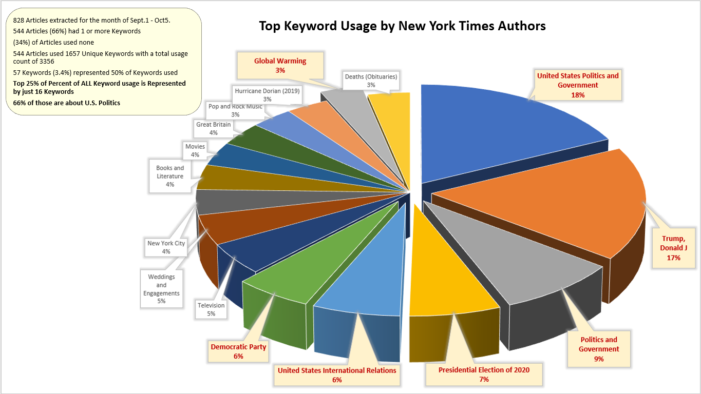

# Project1-Team5

## See NYT Analysis.docx for write-up of our project findings
   * Primary code for to support our findings/write-up are in Jupyter Notebook "Final_NB.ipynb"

## See Group 5 Project 1 Powerpoint.pptx for our charts used during presentation

### Below is the powerpoint chart where I provided analysis regarding the keywords used by NYT writers.

